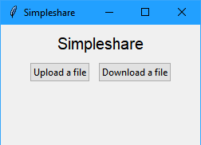
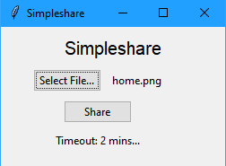
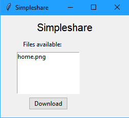

# simpleshare
A local file sharing utility written in Python. Uses multicast UDP to share the files, and HTTP to transfer them.

## Goal:
- Single binary output
- Cross platform
- CLI
  - Args for the file name
- GUI
  - DnD support. 
- Once file is shared as server, client app on same network will be able to see that "someone" is sharing, and download the file.
- Folder support

## TODO:
- [x] Structure program
  - [x] 3 connections
    - [x] Server: Share filename (Multicast)
    - [x] Client: Reply to server saying that you want the file (UDP)
    - [x] Server: Send file to client (TCP)
  - [x] CLI
  - [x] GUI
- Server
  - [x] "Broadcast" (multicast) that you're sharing "x" file
  - [x] Have server send files if requested to IP found.
  - [x] CLI
  - [x] GUI
    - [ ] DnD
    - [ ] Custom timout
- Client
  - [x] Listen to see if anyone is sharing files
  - [x] List available files
  - [x] Download files to specified file name/path
  - [x] CLI
  - [x] GUI
- [x] Make this work with 1 file, 1 client
- [ ] Make this work with 1 file, 2 clients
- [ ] Make this work with 1 dir, 1 client
- [ ] Make this work with 1 dir, 2 clients
- [ ] Make this work with 2 files (2 servers), 1 client
- [ ] Make this work with 2 files (2 servers), 2 client
- [x] Binary output (.exe, .app, etc.)
  - [ ] Icon support
- [ ] Refactor + document
- [ ] Unit Tests

## Bugs:
- [ ] Thread won't stop properly
- [ ] Can't have 2 clients
- [ ] GUI 
  - [ ] Styling
  - [ ] Only Choose IP if more than 1 available
  - [ ] Choose IP should have entry too
  - [ ] Share Thread issues

## Installation:
- Source:
  - Install Python 3
  - ```
    $ git clone https://github.com/ssebs/simpleshare
    $ cd simpleshare/
    $ python -m venv venv
    ```
  - Linux: 
    - `$ source ./venv/bin/activate`
  - Windows: 
    - `> .\venv\Scripts\activate`
    ```
    (venv) $ pip install -r requirements.txt
    ```
- Binary:
  - TBD, just download a binary for your platform

## Usage:
- CLI
  ```
  usage: simpleshare.py [-h] [--type {client,server}] [--ip IP] [FILENAME]

  Local file sharing utility. Can be used as server and as a client. Run this
  without any arguments to run GUI.

  positional arguments:
    FILENAME              Name of the file you want to share, if running as the
                          server.

  optional arguments:
    -h, --help            show this help message and exit
    --type {client,server}
                          Type, how do you want to use this tool
    --ip IP               IP address, only used if you're the server
  ```
- GUI
  - TBD, Double click the gui binary and follow the instructions.

## Building
- Linux:
  - `$ make`
- Windows:
  - `> .\Makefile.bat`
- `(venv) $ pyinstaller simpleshare/__main__.py --clean -F -n simpleshare`

## Screenshots

### Home


### Upload


### Download


## License
[MIT](./LICENSE) &copy; 2019 Sebastian Safari
